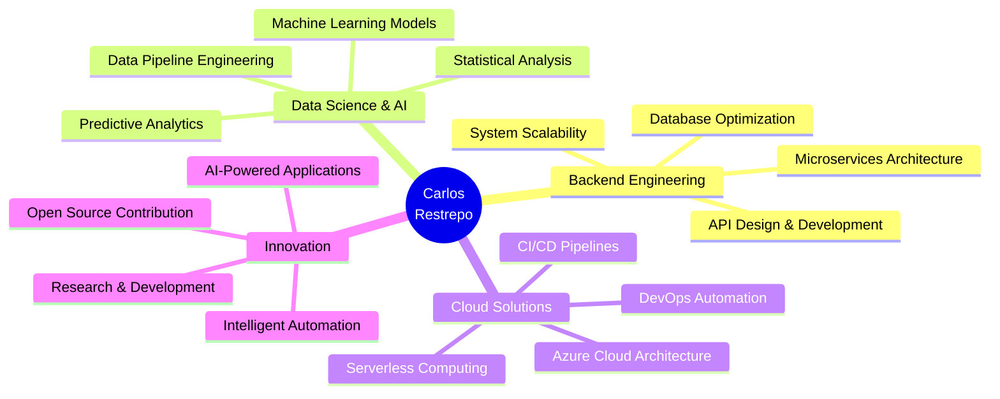

<div align="center">
  
</div>

<div align="center">
  
</div>

<br/>

<div align="center">
  
[](mailto:restrepoospino@gmail.com)
[](https://instagram.com/restrepodev?igshid=OGQ5ZDc2ODk2ZA==)
[](https://www.linkedin.com/in/carlos-manuel-restrepo-ospino-005b96266/)

</div>

---

<div align="center">
<h2>🌟 About Me</h2>
</div>

<table>
<tr>
<td width="60%">

```python
class CarlosRestrepo:
    def __init__(self):
        self.name = "Carlos Manuel Restrepo Ospino"
        self.role = "Backend Developer & AI Engineer"
        self.specialization = [
            "🔧 Backend Architecture",
            "📊 Data Science & Analytics", 
            "🤖 Machine Learning & AI",
            "☁️  Cloud Computing (Azure)",
            "🏗️  Scalable System Design"
        ]
        self.mindset = "Analytical, Creative, Results-Driven"
    
    def get_passion(self):
        return """
        Transformo datos complejos en insights accionables
        y construyo sistemas backend robustos que escalan.
        Mi pasión es resolver problemas complejos con
        soluciones elegantes e innovadoras.
        """
    
    def current_focus(self):
        return ["AI/ML Model Deployment", "Data Pipeline Optimization", 
                "Cloud Architecture", "Advanced Analytics"]
```

</td>
<td width="40%">

<br/>

<div align="center">

</div>

</td>
</tr>
</table>

---

<div align="center">
<h2>🚀 Core Technologies & Expertise</h2>
</div>

### 🔧 Backend Development
<div align="center">


</div>

### 🤖 AI & Data Science
<div align="center">


</div>

### ☁️ Cloud & DevOps
<div align="center">


</div>

---

<div align="center">
<h2>🏆 Professional Certifications</h2>
</div>

<div align="center">
<table>
<tr>
<td align="center" width="25%">
<div style="background: linear-gradient(135deg, #667eea 0%, #764ba2 100%); padding: 20px; border-radius: 10px;">
<br/>
<strong>🔬 Bootcamp</strong><br/>
<strong>Data Science</strong><br/>
<em>Microsoft Azure</em>
</div>
</td>
<td align="center" width="25%">
<div style="background: linear-gradient(135deg, #f093fb 0%, #f5576c 100%); padding: 20px; border-radius: 10px;">
<br/>
<strong>🤖 Artificial</strong><br/>
<strong>Intelligence</strong><br/>
<em>Fundamentals</em>
</div>
</td>
<td align="center" width="25%">
<div style="background: linear-gradient(135deg, #4facfe 0%, #00f2fe 100%); padding: 20px; border-radius: 10px;">
<br/>
<strong>⚡ Agile</strong><br/>
<strong>Explorer</strong><br/>
<em>Methodologies</em>
</div>
</td>
<td align="center" width="25%">
<div style="background: linear-gradient(135deg, #fa709a 0%, #fee140 100%); padding: 20px; border-radius: 10px;">
<br/>
<strong>📱 Mobile App</strong><br/>
<strong>Development</strong><br/>
<em>Android Specialist</em>
</div>
</td>
</tr>
</table>
</div>

---

<div align="center">
<h2>📊 GitHub Analytics & Activity</h2>
</div>

<div align="center">
  
</div>

<div align="center">

</div>

---

<div align="center">
<h2>💡 Current Focus & Projects</h2>
</div>



---

<div align="center">
<h2>🎯 Professional Philosophy</h2>
</div>

<table>
<tr>
<td width="33%" align="center">

### 🧠 **Analytical Thinking**
*"Every complex problem has an elegant solution waiting to be discovered through methodical analysis and creative thinking."*

**Approach:**
- Data-driven decisions
- Systematic problem solving
- Pattern recognition
- Continuous optimization

</td>
<td width="33%" align="center">

### 🚀 **Innovation Mindset**
*"Technology should not just solve today's problems, but anticipate tomorrow's opportunities."*

**Focus:**
- Cutting-edge solutions
- Scalable architectures
- Future-proof designs
- Continuous learning

</td>
<td width="33%" align="center">

### 🤝 **Collaborative Spirit**
*"The best solutions emerge when diverse minds work together towards a common vision."*

**Values:**
- Team collaboration
- Knowledge sharing
- Mentoring others
- Community contribution

</td>
</tr>
</table>

---

<div align="center">
<h2>🛠️ Development Environment</h2>
</div>

<div align="center">

```yaml
Carlos_Development_Setup:
  OS: "Windows 11"
  IDE: 
    Primary: "VS Code, Cursor"
    Secondary: "IntelliJ IDEA, Android Studio"
  Terminal: "Windows Terminal with Oh My Posh"
  Version_Control: "Git with GitHub/GitLab"
  Cloud_Platform: "Microsoft Azure / Google Cloud Platform"
  Databases: "PostgreSQL, MySQL, MongoDB"
  Containers: "Docker & Docker Compose"
  AI_ML_Stack: "Python, TensorFlow, Scikit-learn, Pandas"
  Collaboration: "Slack, Microsoft Teams, Notion"
```

</div>

---

<div align="center">
<h2>🌟 What Drives Me</h2>
</div>

<div align="center">

</div>

---

<div align="center">
<h2>🤝 Let's Connect & Collaborate</h2>
</div>

<div align="center">

### 🚀 Ready for the next challenge?
### 💡 Have an innovative project idea?
### 🎯 Looking for a dedicated backend developer?

<br/>

<table>
<tr>
<td align="center">
<br/>
<strong>Email Me</strong><br/>
<a href="mailto:restrepoospino@gmail.com">restrepoospino@gmail.com</a>
</td>
<td align="center">
<br/>
<strong>LinkedIn</strong><br/>
<a href="https://www.linkedin.com/in/carlos-manuel-restrepo-ospino-005b96266/">Connect with me</a>
</td>
<td align="center">
<br/>
<strong>Instagram</strong><br/>
<a href="https://instagram.com/restrepodev?igshid=OGQ5ZDc2ODk2ZA==">@restrepodev</a>
</td>
<td align="center">
<br/>
<strong>GitHub</strong><br/>
<a href="https://github.com/proCarlos2001">Follow my work</a>
</td>
</tr>
</table>

<br/>

[](mailto:restrepoospino@gmail.com)

</div>

---

<div align="center">

<br/><br/>

</div>

<div align="center">
  
</div>
