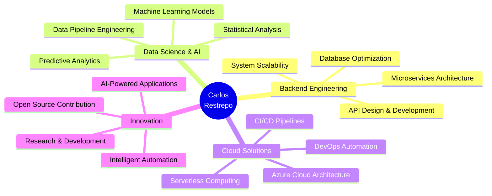

<div align="center">
  
</div>

<div align="center">
  
</div>

<br/>

<div align="center">
  
[](mailto:restrepoospino@gmail.com)
[](https://instagram.com/restrepodev?igshid=OGQ5ZDc2ODk2ZA==)
[](https://www.linkedin.com/in/carlos-manuel-restrepo-ospino-005b96266/)

</div>

---

<div align="center">
<h2>🌟 About Me</h2>
</div>

<table>
<tr>
<td width="60%">

```python
class CarlosRestrepo:
    def __init__(self):
        self.name = "Carlos Manuel Restrepo Ospino"
        self.role = "Software Developer & AI Engineer"
        self.location = "Cali, Valle del Cauca, Colombia"
        self.education = [
            "🎓 Tecnólogo en Análisis y Desarrollo de Software (SENA)",
            "🎓 Diplomado en Programación Móvil (UNAL)"
        ]
        self.specialization = [
            "🔧 Backend Development (Python, Java, Kotlin)",
            "📊 Data Science & Analytics", 
            "🤖 Machine Learning & AI (TensorFlow, scikit-learn)",
            "☁️  Cloud Computing (Azure, AWS)",
            "💬 Chatbots & NLP (IBM Granite)",
            "🏗️  ETL Pipelines & Data Processing"
        ]
        self.experience = "1+ año como Desarrollador Freelance"
        self.mindset = "Analytical, Creative, Results-Driven"
    
    def get_passion(self):
        return """
        Transformo datos complejos en insights accionables
        y construyo sistemas backend robustos con IA.
        Especializado en soluciones de Machine Learning,
        procesamiento de datos y chatbots inteligentes.
        """
    
    def current_focus(self):
        return ["AI/ML Model Deployment", "ETL Pipeline Optimization", 
                "Cloud Architecture", "Conversational AI"]
    
    def get_certifications(self):
        return {
            "IBM": ["AI Fundamentals", "ML with Python", "Data Visualization"],
            "Azure": ["Data Science Bootcamp"],
            "SENA": ["English Does Work (5 niveles)"]
        }
```

</td>
<td width="40%">

<br/>

<div align="center">

</div>

</td>
</tr>
</table>

---

<div align="center">
<h2>💼 Experiencia Laboral</h2>
</div>

<div align="center">
<table>
<tr>
<td width="100%">

### 🚀 DESARROLLADOR FREELANCE
**Colaborador Externo** | *Septiembre 2024 - Actualidad*

📍 **Responsabilidades clave:**
- 🤖 Desarrollo e implementación de soluciones de IA y ciencia de datos para proyectos empresariales
- 💬 Especialización en modelos de lenguaje de gran escala (LLM) y procesamiento de datos
- 🔄 Diseño y ejecución de pipelines ETL para transformación y análisis de datos empresariales
- 📊 Implementación de modelos de Machine Learning para análisis predictivo y clasificación de datos
- 🗣️ Desarrollo de chatbots y asistentes conversacionales con IA generativa y modelos IBM Granite
- 📈 Procesamiento y visualización de datos con Python, pandas y matplotlib

💡 **Tecnologías utilizadas:** Python, TensorFlow, scikit-learn, IBM Granite, pandas, NumPy, Azure, Docker, PostgreSQL

</td>
</tr>
</table>
</div>

---

<div align="center">
<h2>🎓 Formación Académica</h2>
</div>

<div align="center">
<table>
<tr>
<td align="center" width="50%">

### 📚 Tecnólogo en Análisis y Desarrollo de Software
**Servicio Nacional de Aprendizaje (SENA)**

📅 *Marzo 2023 - Actualidad*

🎯 **Estado:** En curso

</td>
<td align="center" width="50%">

### 📱 Diplomado en Programación con Énfasis en Aplicaciones Móviles
**Universidad Nacional de Colombia (UNAL)**

📅 *Abril 2022 - Diciembre 2022*

✅ **Estado:** Completado

</td>
</tr>
</table>
</div>

---

<div align="center">
<h2>🌍 Idiomas</h2>
</div>

<div align="center">
<table>
<tr>
<td align="center" width="50%">
<br/>
<strong>🇨🇴 Lengua Materna</strong><br/>
<em>Dominio completo</em>
</td>
<td align="center" width="50%">
<br/>
<strong>🇬🇧 Intermedio</strong><br/>
<em>English Does Work (SENA)</em>
</td>
</tr>
</table>
</div>

---

<div align="center">
<h2>🚀 Core Technologies & Expertise</h2>
</div>

### 🔧 Backend Development
<div align="center">


</div>

### 🤖 AI & Data Science
<div align="center">


</div>

### ☁️ Cloud & DevOps
<div align="center">


</div>

### 🌐 Frameworks & Libraries
<div align="center">


</div>

---

<div align="center">
<h2>🏆 Certificaciones Profesionales</h2>
</div>

### 🎖️ IBM SkillsBuild (2025)
<div align="center">
<table>
<tr>
<td align="center" width="33%">
<br/>
<strong>🤖 Fundamentos de</strong><br/>
<strong>Inteligencia Artificial</strong>
</td>
<td align="center" width="33%">
<br/>
<strong>🧠 Machine Learning</strong><br/>
<strong>with Python</strong>
</td>
<td align="center" width="33%">
<br/>
<strong>📊 Data Visualization</strong><br/>
<strong>with Python</strong>
</td>
</tr>
<tr>
<td align="center" width="33%">
<br/>
<strong>🐍 Python 101</strong><br/>
<strong>Data Science</strong>
</td>
<td align="center" width="33%">
<br/>
<strong>📈 Data</strong><br/>
<strong>Fundamentals</strong>
</td>
<td align="center" width="33%">
<br/>
<strong>⚡ Agile</strong><br/>
<strong>Explorer</strong>
</td>
</tr>
</table>
</div>

### 🔬 Código Facilito (2024)
<div align="center">
<table>
<tr>
<td align="center" width="100%">
<br/>
<strong>🎓 Bootcamp de Ciencia de Datos</strong><br/>
<em>Microsoft Azure</em>
</td>
</tr>
</table>
</div>

### 📚 SENA (2023)
<div align="center">
<table>
<tr>
<td align="center" width="100%">
<br/>
<strong>🇬🇧 English Does Work</strong><br/>
<em>Niveles 1-5 Completados</em>
</td>
</tr>
</table>
</div>

### 🔬 UNAL (2021)
<div align="center">
<table>
<tr>
<td align="center" width="100%">
<br/>
<strong>⚛️ Nanotecnología</strong><br/>
<em>y Aplicaciones</em>
</td>
</tr>
</table>
</div>

---

<div align="center">
<h2>📊 GitHub Analytics & Activity</h2>
</div>

<div align="center">
<table>
<tr>
<td width="50%">
  
</td>
<td width="50%">
  
</td>
</tr>
</table>
</div>

<div align="center">

</div>

---

<div align="center">
<h2>🔥 Proyectos Destacados</h2>
</div>

<div align="center">
<table>
<tr>
<td width="50%">

### 🤖 Chatbot con IA Generativa
**Asistente Conversacional Inteligente**
- 🎯 Procesamiento de lenguaje natural avanzado
- 🛠️ Tech: Python, IBM Granite, NLP
- 📊 Resultado: Automatización de consultas empresariales

</td>
<td width="50%">

### 📊 Pipeline ETL de Datos
**Sistema de Transformación de Datos**
- 🎯 Procesamiento y análisis de datos empresariales
- 🛠️ Tech: Python, pandas, SQL, Azure
- 📊 Resultado: Optimización de procesos de análisis

</td>
</tr>
<tr>
<td width="50%">

### 🧠 Modelo de Machine Learning
**Análisis Predictivo y Clasificación**
- 🎯 Predicción de patrones en datos empresariales
- 🛠️ Tech: Python, TensorFlow, scikit-learn
- 📊 Resultado: Mejora en toma de decisiones

</td>
<td width="50%">

### 📱 Aplicación Móvil (Diplomado)
**App Android con Kotlin**
- 🎯 Desarrollo de aplicación móvil nativa
- 🛠️ Tech: Kotlin, Android Studio, Firebase
- 📊 Resultado: Proyecto final del diplomado UNAL

</td>
</tr>
</table>
</div>

---

<div align="center">
<h2>💡 Current Focus & Projects</h2>
</div>


```mermaid
mindmap
  root((Carlos<br/>Restrepo))
    Backend Engineering
      API Design & Development
      Microservices Architecture
      Database Optimization
      System Scalability
    Data Science & AI
      Machine Learning Models
      Predictive Analytics
      Data Pipeline Engineering
      Statistical Analysis
    Cloud Solutions
      Azure Cloud Architecture
      Serverless Computing
      DevOps Automation
      CI/CD Pipelines
    Innovation
      AI-Powered Applications
      Intelligent Automation
      Research & Development
      Open Source Contribution
```

---

<div align="center">
<h2>🎯 Professional Philosophy</h2>
</div>

<table>
<tr>
<td width="33%" align="center">

### 🧠 **Analytical Thinking**
*"Every complex problem has an elegant solution waiting to be discovered through methodical analysis and creative thinking."*

**Approach:**
- Data-driven decisions
- Systematic problem solving
- Pattern recognition
- Continuous optimization

</td>
<td width="33%" align="center">

### 🚀 **Innovation Mindset**
*"Technology should not just solve today's problems, but anticipate tomorrow's opportunities."*

**Focus:**
- Cutting-edge solutions
- Scalable architectures
- Future-proof designs
- Continuous learning

</td>
<td width="33%" align="center">

### 🤝 **Collaborative Spirit**
*"The best solutions emerge when diverse minds work together towards a common vision."*

**Values:**
- Team collaboration
- Knowledge sharing
- Mentoring others
- Community contribution

</td>
</tr>
</table>

---

<div align="center">
<h2>🛠️ Development Environment</h2>
</div>

<div align="center">

```yaml
Carlos_Development_Setup:
  OS: "Windows 11"
  IDE: 
    Primary: "VS Code, Cursor"
    Secondary: "IntelliJ IDEA, Android Studio"
  Terminal: "Windows Terminal with Oh My Posh"
  Version_Control: "Git with GitHub/GitLab"
  Cloud_Platform: "Microsoft Azure / Google Cloud Platform"
  Databases: "PostgreSQL, MySQL, MongoDB"
  Containers: "Docker & Docker Compose"
  AI_ML_Stack: "Python, TensorFlow, Scikit-learn, Pandas"
  Collaboration: "Slack, Microsoft Teams, Notion"
```

</div>

---

<div align="center">
<h2>🌟 What Drives Me</h2>
</div>

<div align="center">

</div>

---

<div align="center">
<h2>🤝 Let's Connect & Collaborate</h2>
</div>

<div align="center">

### 🚀 Ready for the next challenge?
### 💡 Have an innovative project idea?
### 🎯 Looking for a dedicated backend developer?

<br/>

<table>
<tr>
<td align="center">
<br/>
<strong>Email Me</strong><br/>
<a href="mailto:restrepoospino@gmail.com">restrepoospino@gmail.com</a>
</td>
<td align="center">
<br/>
<strong>LinkedIn</strong><br/>
<a href="https://www.linkedin.com/in/carlos-manuel-restrepo-ospino-005b96266/">Connect with me</a>
</td>
<td align="center">
<br/>
<strong>Instagram</strong><br/>
<a href="https://instagram.com/restrepodev?igshid=OGQ5ZDc2ODk2ZA==">@restrepodev</a>
</td>
<td align="center">
<br/>
<strong>GitHub</strong><br/>
<a href="https://github.com/proCarlos2001">Follow my work</a>
</td>
</tr>
</table>

<br/>

[](mailto:restrepoospino@gmail.com)

</div>

---

<div align="center">

<br/><br/>

</div>

<div align="center">
  
</div>
