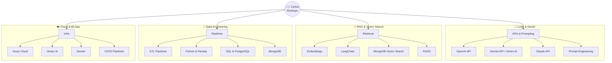

<div align="center">
  
</div>

<div align="center">
  
</div>

<br/>

<div align="center">
  
[](mailto:restrepoospino@gmail.com)
[](https://instagram.com/restrepodev?igshid=OGQ5ZDc2ODk2ZA==)
[](https://www.linkedin.com/in/carlos-manuel-restrepo-ospino-005b96266/)

</div>

---

<div align="center">
<h2>🌟 About Me</h2>
</div>

<table>
<tr>
<td width="60%">

```python
class CarlosRestrepo:
    def __init__(self):
        self.name = "Carlos Manuel Restrepo Ospino"
        self.role = "AI/LLM Engineer & Data Specialist"
        self.specialization = [
            "🤖 LLMs & Prompt Engineering",
            "🧠 NLP (Natural Language Processing)",
            "🔎 RAG Systems & Vector Search",
            "📐 Embeddings & Semantic Retrieval",
            "🔄 ETL & Data Pipelines",
            "☁️  Cloud AI (Azure / Vertex AI)"
        ]
        self.mindset = "Analytical, Creative, Results-Driven"
    
    def get_passion(self):
        return """
        Diseño y despliego sistemas basados en LLMs (OpenAI, Gemini,
        Claude) capaces de razonar sobre datos propios mediante RAG
        y embeddings. Mi pasión es transformar datos complejos en
        soluciones de IA generativa robustas y escalables.
        """
    
    def current_focus(self):
        return ["LLM & GenAI API Integration", "RAG Pipelines & Vector DBs",
                "ETL / Data Pipeline Engineering", "Model Deployment (Azure & Vertex AI)"]
```

</td>
<td width="40%">

<br/>

<div align="center">

</div>

</td>
</tr>
</table>

---

<div align="center">
<h2>🚀 Core Technologies & Expertise</h2>
</div>

### 🤖 LLMs & GenAI APIs
<div align="center">


</div>

### 🔎 RAG, Embeddings & Vector Search
<div align="center">


</div>

### 🔄 Data Engineering & Python
<div align="center">


</div>

### ☁️ Cloud & MLOps
<div align="center">


</div>

---

<div align="center">
<h2>🏆 Professional Certifications</h2>
</div>

<div align="center">
<table>
<tr>
<td align="center" width="33%">
<div style="background: linear-gradient(135deg, #667eea 0%, #764ba2 100%); padding: 20px; border-radius: 10px;">
<br/>
<strong>🔬 Bootcamp</strong><br/>
<strong>Data Science</strong><br/>
<em>Microsoft Azure</em>
</div>
</td>
<td align="center" width="33%">
<div style="background: linear-gradient(135deg, #f093fb 0%, #f5576c 100%); padding: 20px; border-radius: 10px;">
<br/>
<strong>🤖 Artificial</strong><br/>
<strong>Intelligence</strong><br/>
<em>Fundamentals</em>
</div>
</td>
<td align="center" width="33%">
<div style="background: linear-gradient(135deg, #4facfe 0%, #00f2fe 100%); padding: 20px; border-radius: 10px;">
<br/>
<strong>⚡ Agile</strong><br/>
<strong>Explorer</strong><br/>
<em>Methodologies</em>
</div>
</td>
</tr>
</table>
</div>

---

<div align="center">
<h2>📊 GitHub Analytics & Activity</h2>
</div>

<div align="center">
  
</div>

<div align="center">

</div>

---

<div align="center">
<h2>💡 Current Focus & Projects</h2>
</div>


```mermaid
flowchart TD
    ME(("🧑‍💻 Carlos<br/>Restrepo"))

    subgraph S1["🤖 LLMs & GenAI"]
        L0["APIs & Prompting"]
        L0 --> L1["OpenAI API"]
        L0 --> L2["Gemini API / Vertex AI"]
        L0 --> L3["Claude API"]
        L0 --> L4["Prompt Engineering"]
    end

    subgraph S2["🔎 RAG & Vector Search"]
        R0["Retrieval"]
        R0 --> R1["Embeddings"]
        R0 --> R2["LangChain"]
        R0 --> R3["MongoDB Vector Search"]
        R0 --> R4["FAISS"]
    end

    subgraph S3["🔄 Data Engineering"]
        D0["Pipelines"]
        D0 --> D1["ETL Pipelines"]
        D0 --> D2["Python & Pandas"]
        D0 --> D3["SQL & PostgreSQL"]
        D0 --> D4["MongoDB"]
    end

    subgraph S4["☁️ Cloud & MLOps"]
        C0["Infra"]
        C0 --> C1["Azure Cloud"]
        C0 --> C2["Vertex AI"]
        C0 --> C3["Docker"]
        C0 --> C4["CI/CD Pipelines"]
    end

    ME --> L0
    ME --> R0
    ME --> D0
    ME --> C0
```

---

<div align="center">
<h2>🎯 Professional Philosophy</h2>
</div>

<table>
<tr>
<td width="33%" align="center">

### 🧠 **Analytical Thinking**
*"Every complex problem has an elegant solution waiting to be discovered through methodical analysis and creative thinking."*

**Approach:**
- Data-driven decisions
- Systematic problem solving
- Pattern recognition
- Continuous optimization

</td>
<td width="33%" align="center">

### 🚀 **Innovation Mindset**
*"Technology should not just solve today's problems, but anticipate tomorrow's opportunities."*

**Focus:**
- LLM & GenAI solutions
- Scalable RAG architectures
- Future-proof AI pipelines
- Continuous learning

</td>
<td width="33%" align="center">

### 🤝 **Collaborative Spirit**
*"The best solutions emerge when diverse minds work together towards a common vision."*

**Values:**
- Team collaboration
- Knowledge sharing
- Mentoring others
- Community contribution

</td>
</tr>
</table>

---

<div align="center">
<h2>🛠️ Development Environment</h2>
</div>

<div align="center">

```yaml
Carlos_Development_Setup:
  OS: "Windows 11"
  IDE: 
    Primary: "VS Code, Cursor"
    Secondary: "IntelliJ IDEA"
  Terminal: "Windows Terminal with Oh My Posh"
  Version_Control: "Git with GitHub/GitLab"
  Cloud_Platform: "Microsoft Azure / Google Cloud (Vertex AI)"
  Databases: "PostgreSQL, MongoDB, MongoDB Atlas Vector Search, FAISS"
  Containers: "Docker & Docker Compose"
  AI_ML_Stack: "Python, OpenAI SDK, Google Gen AI SDK (Vertex AI), Anthropic SDK, LangChain, Pandas, Scikit-learn"
  Collaboration: "Slack, Microsoft Teams, Notion"
```

</div>

---

<div align="center">
<h2>🌟 What Drives Me</h2>
</div>

<div align="center">

</div>

---

<div align="center">
<h2>🤝 Let's Connect & Collaborate</h2>
</div>

<div align="center">

### 🚀 Ready for the next challenge?
### 💡 Have an innovative project idea?
### 🎯 Looking for an AI/LLM engineer?

<br/>

<table>
<tr>
<td align="center">
<br/>
<strong>Email Me</strong><br/>
<a href="mailto:restrepoospino@gmail.com">restrepoospino@gmail.com</a>
</td>
<td align="center">
<br/>
<strong>LinkedIn</strong><br/>
<a href="https://www.linkedin.com/in/carlos-manuel-restrepo-ospino-005b96266/">Connect with me</a>
</td>
<td align="center">
<br/>
<strong>Instagram</strong><br/>
<a href="https://instagram.com/restrepodev?igshid=OGQ5ZDc2ODk2ZA==">@restrepodev</a>
</td>
<td align="center">
<br/>
<strong>GitHub</strong><br/>
<a href="https://github.com/proCarlos2001">Follow my work</a>
</td>
</tr>
</table>

<br/>

[](mailto:restrepoospino@gmail.com)

</div>

---

<div align="center">

<br/><br/>

</div>

<div align="center">
  
</div>
